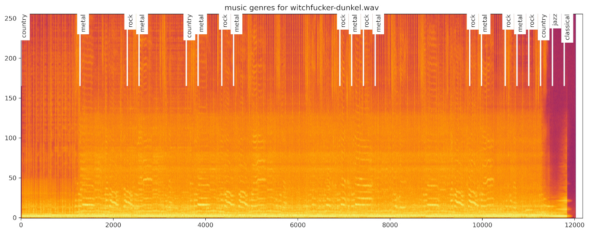

# Music Classifier

The Music Classifier is a small and straight forward Convolutional Neural Network for classifying the genre of a given audio input file. The network uses spectrograms for this.

More detailled informations follows.